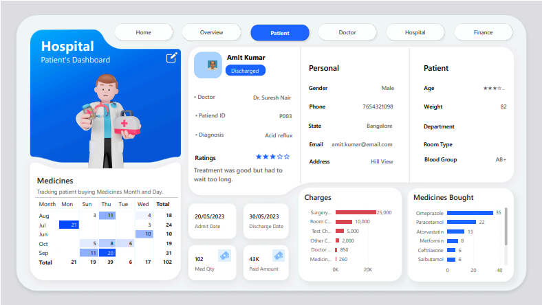
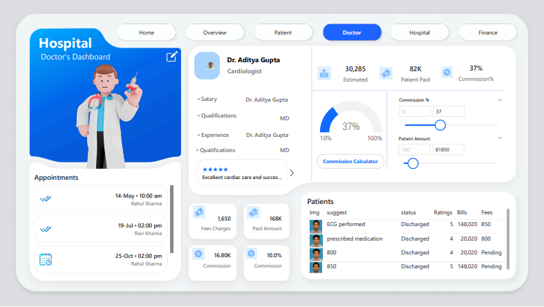
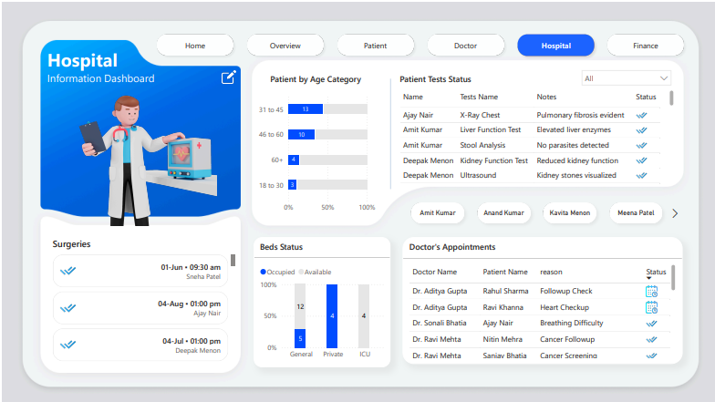
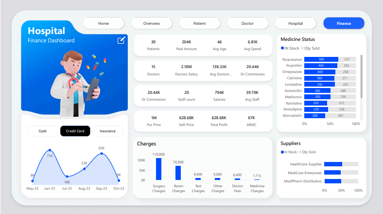

# 🏥 Hospital Analytics Dashboard | Power BI  
**Enterprise-Grade Healthcare Business Intelligence Solution**

---

## 📌 Project Overview

This project presents a **comprehensive Hospital Analytics Dashboard developed in Power BI** to deliver **real-time insights across clinical operations, hospital management, and financial performance**.  
It transforms raw hospital data into **actionable business intelligence** for informed decision-making.

The dashboard enables data-driven monitoring across:
- Patient Management
- Doctor Performance
- Hospital Operations
- Financial Performance

This solution is designed to meet **corporate BI and enterprise analytics standards**.

---

## 🎯 Business Objectives

The dashboard is built to address the following business goals:

- Monitor **patient admissions, discharges, and occupancy**
- Track **doctor productivity and revenue contribution**
- Optimize **bed utilization and hospital capacity**
- Control **medicine inventory and supplier performance**
- Analyze **hospital profitability and cost drivers**
- Enable **executive-level performance monitoring**

---

## 🛠 Technology Stack

- **BI Tool:** Power BI Desktop  
- **Data Source:** Excel / CSV Healthcare Dataset  
- **Data Modeling:** Fact & Dimension Tables (Star Schema)  
- **Analytics:** DAX Measures & Calculated KPIs  
- **Visualization:** Interactive Dashboards, Slicers & Filters  

---

## 🧩 Dashboard Architecture

The solution consists of **five integrated analytical modules**:

1. Executive Overview  
2. Patient Analytics  
3. Doctor Performance Analytics  
4. Hospital Operations  
5. Financial Performance  

Each module supports both **strategic leadership decisions and operational execution**.

---

# 📊 Dashboard Modules – Business Analysis

---

## 1️⃣ Executive Overview Dashboard

**Purpose:** High-level snapshot of overall hospital performance.

### Key KPIs:
- Total Patients  
- Total Doctors  
- Total Staff  
- Total Revenue  
- Discharge Rate (%)  
- Bed Occupancy Status  
- Medicine Stock Status  
- Charges by Category (Surgery, Room, Tests, Doctor Fees, Medicines)

### Business Insights:
- Instant visibility into hospital workload  
- Revenue vs patient volume tracking  
- Operational bottleneck identification  
- Executive-level performance monitoring


## 🟦 1. Overview Dashboard

---

## 2️⃣ Patient Analytics Dashboard

**Purpose:** Detailed analysis of patient demographics, treatment, and spending.

### Key Metrics:
- Patient Demographics (Age, Gender, Blood Group, Weight)
- Admission & Discharge Dates  
- Diagnosis & Department  
- Medicine Consumption  
- Treatment Charges Breakdown  
- Patient Feedback & Ratings  

### Business Value:
- Patient cost optimization  
- Service quality monitoring  
- High-value patient identification  
- Personalized treatment assessment  

📷 Screenshot:  


---

## 3️⃣ Doctor Performance Dashboard

**Purpose:** Performance, earnings, and productivity analysis of doctors.

### Key Metrics:
- Doctor Profile & Specialization  
- Appointment Load  
- Revenue Generated  
- Commission & Salary  
- Patient Ratings  
- Pending & Paid Bills  

### Business Value:
- Performance-based incentive tracking  
- Revenue-driving doctor identification  
- Workload distribution optimization  
- Clinical productivity management  

📷 Screenshot:  


---

## 4️⃣ Hospital Operations Dashboard

**Purpose:** Hospital infrastructure and operational efficiency monitoring.

### Key Metrics:
- Bed Availability (ICU, General, Private)
- Surgery Scheduling
- Diagnostic Test Monitoring
- Doctor Appointment Tracking
- Patient Age Group Distribution  

### Business Value:
- Bed utilization optimization  
- Surgery planning efficiency  
- Capacity planning & resource allocation  
- Overcrowding risk prevention  

📷 Screenshot:  


---

## 5️⃣ Financial Performance Dashboard

**Purpose:** Complete financial health and profitability monitoring.

### Key Financial KPIs:
- Total Revenue  
- Paid Amount  
- Average Patient Spend  
- Doctor Payroll  
- Staff Salary  
- Total Profit  
- Doctor Commission  
- Supplier & Medicine Inventory Cost  

### Financial Intelligence:
- Profitability trend tracking  
- Revenue leakage identification  
- Expense control  
- Budgeting & forecasting support  

📷 Screenshot:  


---

## ⬇️ How to Use the Dashboard

1. Download the `.pbix` file from this folder.
2. Open it in **Power BI Desktop**.
3. Navigate through the 5 report pages.
4. Use slicers and filters for:
   - Date
   - Department
   - Doctor
   - Patient Segment
5. Analyze trends, KPIs, and performance metrics interactively.

---

## 📁 Repository Structure

```text
Hospital_Analysis_Dashboard/
├── Hospital_Analysis_Dashboard.pbix
├── overview.png
├── patient.png
├── doctor.png
├── hospital.png
├── finance.png
└── README.md


---

## 👩‍💻 Author
Akshatha – Aspiring Data Analyst & Power BI Developer
